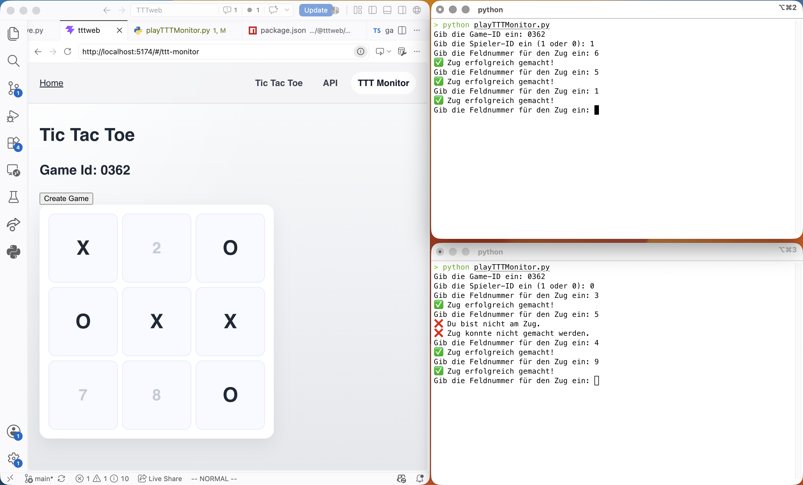

- Router Probleme
  - Nevbar wird automatisch vom Renderer gesetzt
  - Wie reagiere ich auf Änderungen

- TODO
  - Wie lade ich nur den Betroffenen Teil der Seite neu
  - Board andere größe als 3, aktuell hängt es sich nur auf
  - Server Game authenticate player
  - Wann lösche ich ein Game im backend
  - Fix draw bei TTT Monitor

