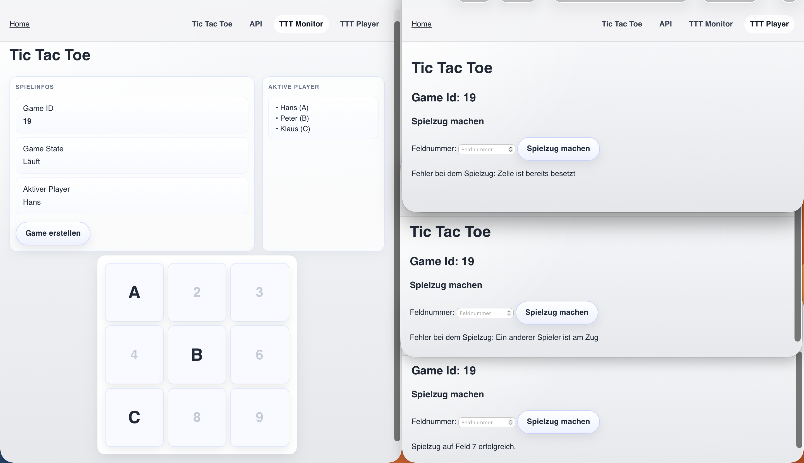

# TTTweb

TTTweb ist eine browserbasierte Tic-Tac-Toe-Anwendung. Das Projekt ist vollständig in TypeScript geschrieben und besteht aus einem Vite-Frontend, einem Express-Backend sowie einem gemeinsamen Bereich für die Spiellogik.

## Funktionen

### Tic-Tac-Toe im Frontend

Auf der normalen Tic-Tac-Toe-Seite kann direkt im Browser gespielt werden:

- alleine gegen den Computer
- zu zweit an einem Gerät

Die Spieloberfläche verwendet die Spiellogik aus dem Shared-Bereich.

### TTT Monitor

Der TTT Monitor ist ein verteiltes Spiel, bei dem das Backend die zentrale Verantwortung für das Spiel übernimmt:

1. Im Frontend wird ein neues Spiel angefragt.
2. Das Backend erstellt das Spiel und vergibt eine eindeutige ID.
3. Die ID wird im Frontend angezeigt und kann zum Abrufen des Spiels verwendet werden.
4. Spielzüge werden per API an das Backend gesendet.
5. Das Backend prüft, welcher Spieler an der Reihe ist und ob der Spielzug zulässig ist.
6. Das Frontend verbindet sich zusätzlich per WebSocket mit dem Backend.
7. Änderungen am Spiel werden in Echtzeit an verbundene Frontends übertragen und dort dargestellt.

Dadurch liegt die Ownership des Spiels beim Backend. Der aktuelle Spielstand und die Regeln werden nicht nur lokal im Browser, sondern zentral auf dem Server kontrolliert.

Ein Beispiel für den Ablauf des TTT Monitors:



### TTT Player

Der TTT Player ist eine eigene Seite, mit der ein Spieler einem bereits laufenden TTT-Monitor-Spiel beitreten kann. Dazu wird die Game-ID eingegeben, anschließend erhält der Spieler ein eigenes Token und kann seine Züge über die API an das Backend senden. Die Authentifizierung erfolgt über diesen Token, sodass jeder Spieler nur für sich selbst spielen kann und nicht als anderer Teilnehmer agieren kann. So kann ein Spieler an einem auf dem Server verwalteten Spiel teilnehmen, ohne selbst das Spiel lokal zu verwalten.

## Architektur

```text
TTTweb/
├── frontend/   Vite-Anwendung und Benutzeroberfläche
├── backend/    Express-API und WebSocket-Server
└── shared/     Gemeinsame Tic-Tac-Toe-Modelle und Spiellogik
```

### Frontend

Das Frontend wird mit Vite entwickelt und stellt die Seiten für das lokale Spiel und den TTT Monitor bereit. Es ruft die Backend-API für serververwaltete Spiele auf und empfängt Änderungen über WebSockets.

### Backend

Das Backend basiert auf Express. Es erstellt und verwaltet Spiele, verarbeitet Spielzüge und stellt den Spielstand über eine API bereit. Zusätzlich läuft dort der WebSocket-Server für Echtzeit-Updates.

### Shared

Im Shared-Paket liegen die TypeScript-Typen und die zentrale Spiellogik. Dadurch können Frontend und Backend dieselben Modelle und Regeln verwenden.

## Voraussetzungen

- Node.js
- npm

## Installation

Im Projektverzeichnis ausführen:

```bash
npm install
```

Die Abhängigkeiten der drei Workspace-Pakete werden über npm Workspaces verwaltet.

## Anwendung starten

Frontend und Backend gemeinsam starten:

```bash
npm run dev
```

Alternativ können beide Teile getrennt gestartet werden:

```bash
npm run dev:frontend
npm run dev:backend
```

Wichtig: In `frontend/src/config.ts` muss die Backend-Adresse in `SERVER_HOST` eingetragen werden, damit die API- und WebSocket-Anfragen an die richtige IP/URL gehen. Beispiel:

```ts
export const SERVER_HOST = "192.168.1.109:3000";
```

Wenn das Backend lokal läuft, kann auch `localhost:3000` verwendet werden. Das Backend läuft standardmäßig auf Port `3000`. Das Frontend wird von Vite bereitgestellt und zeigt die lokale Entwicklungs-URL im Terminal an.
